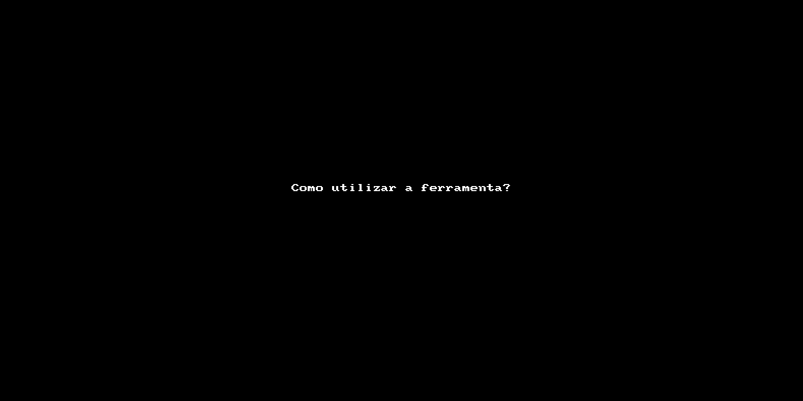

# README: tidyMap

 <!-- Consolida as planilhas de mapeamento, de diferentes jobs, em um formato 'tidy'.

<!-- badges: start -->
[](https://lifecycle.r-lib.org/articles/stages.html#experimental)
<!-- badges: end -->

Este pacote R foi desenvolvido com o objetivo de consolidar planilhas de mapeamento em um formato 'tidy', facilitando a análise de dados por pesquisadores, analistas e outros profissionais que trabalhem com essas planilhas. O pacote consiste em um conjunto de 3 funções:

- ler_arquivos.R
- arrumar_origem.R
- consolidar_arquivos.R

---

#### **ler_arquivos.R**
Esta função recebe uma lista de caminhos (paths) dos arquivos e o número de sheet como parâmetros, e retorna uma tibble arrumada. Além disso, ela realiza as seguintes tarefas:

- Lê os arquivos em formato .xlsx utilizando a biblioteca readxl
- Seleciona as colunas relevantes para análise
- Trata as colunas de datas
- Normaliza os caracteres para ASCII
- Normaliza as informações de UF e outros campos para letras maiúsculas
- Adiciona a coluna Origem, que contém a informação de qual planilha o registro foi extraído.

#### **arrumar_origem.R**
Esta função recebe uma lista de caminhos (paths) dos arquivos e retorna uma string com a origem dos arquivos. Essa origem é extraída do nome do arquivo e inclui informações como a fonte dos dados e o período abrangido.

#### **consolidar_arquivos.R**
Esta função é a que deve ser executada para consolidar todas as planilhas de mapeamento em um único arquivo. Ela não possui parâmetros e retorna um arquivo .xlsx com todas as informações dos arquivos de entrada.

Este pacote é útil para quem trabalha com dados em planilhas de mapeamento e precisa consolidá-las em um formato mais amigável para análise. Esperamos que este pacote facilite o trabalho dos profissionais que lidam com esses dados.

---

### Como utilizar a ferramenta?

1. Abrir o arquivo ‘Projeto.R’
 
2. Aguardar inicialização do RStudio (IDE)
 
3. Rodar o script ‘Run.R’
 
4. Fechar o projeto no RStudio (don’t save)


Output: AAAA-MM-DD_mapeamento.csv

---

- Demonstração:



---

### Dev

Você pode obter a versão de desenvolvimento do pacote através do seguinte comando:

``` r
devtools::install_github('wfaquieri/tidyMap')
```

## Description

Package: /tidyMap

Title: Consolida as planilhas de mapeamento em um formato 'tidy'.

Version: 0.0.0.9000

Authors@R: 
    person("Winicius", "Faquieri", , "winicius.faquieri@fgv.br", role = c("aut", "cre"),
           comment = c(ORCID = "YOUR-ORCID-ID"))
           
Description: Consolida as planilhas de mapeamento num formato 'tidy'.

License: MIT + file LICENSE

Encoding: UTF-8

Roxygen: list(markdown = TRUE)

RoxygenNote: 7.2.1

NeedsCompilation: no

Packaged: 2022-08-25 16:13:21 UTC; Winicius

Author: Winicius Faquieri [aut, cre] (YOUR-ORCID-ID)

Maintainer: Winicius Faquieri <winicius.faquieri@fgv.br>

Built: R 4.2.1; ; 2022-08-25 16:13:22 UTC; windows
